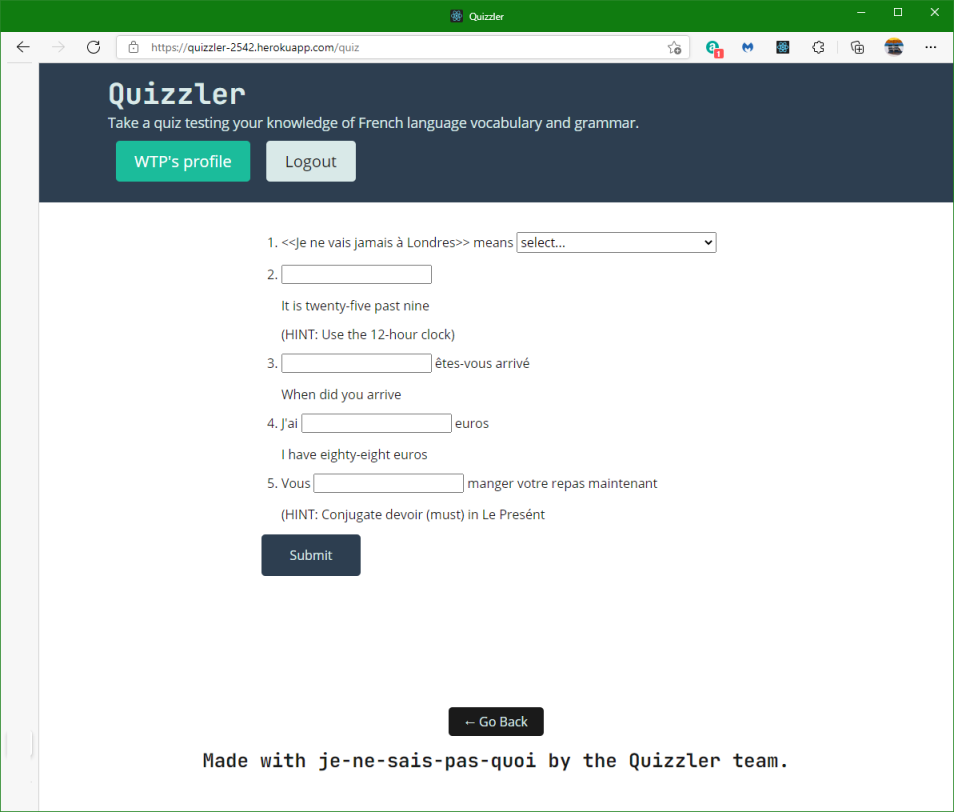

# Quizzler
## Description
Quiz on the vocabulary and grammar of the French language. Full stack MERNG application. Database of users and questions on the Mongodb Atlas cloud storage.  

This app is deployed on Heroku at  

[https://quizzler-2542.herokuapp.com/](https://quizzler-2542.herokuapp.com/)

## Installation
The GitHub repository for this app is  

[https://github.com/minprocess/Quizzler](https://github.com/minprocess/Quizzler)

### Tech used

This app is full stack with server and client.

On the Server: apollo-server-express, graphql, express, bcrypt, dotenv, jsonwebtoken, express, mongoose, mongoose-random
On the Client: apollo/client, graphql, jwt-decode, react, react-dom, react-router-dom, react-scripts, web-vitals

The npm package 'Mongoose-Random' (https://www.npmjs.com/package/mongoose-random) is used to get the quiz questions from the Mongo database. The parameter `limit` is set to 5 in the Quizzler web app which means that 5 quizzes are retrieved from the database at random. The parameter `level` is the level of the ability in speaking or writing a language as measured by the Common European Framework of Reference for Languages.

When the app is run locally on the development PC, the database should be located on that PC. When the app is deployed to Heroku, the database should be located on MongoDB Atlas, which is cloud based. If you run the app from Heroku or equivalent web-based host, you will need an account on MongoDB Atlas, if that is where you want the database to be. You could choose some other cloud based solutions such as AWS, Azure or Google which are the 3 biggest cloud servers.

If Heroku is used and MongoDB Atlas is used, set MONGODB_URI in the Settings page of Heroku in the Config Vars section.

React is used for the front end (client side).

The jsonwebtoken (jwt) package is used to provide user authentication. It runs on the server. The jwt-decode package runs on the client. ACCESS_TOKEN_SECRET is the secret key. It is set in the file `.env`. Make a copy of `.env.EXAMPLE` and rename the copy `.env`. A random sequence of hex numbers for `ACCESS_TOKEN_SECRET` can be created by first starting `node` at a command prompt and then at the node prompt type or paste the command 
`require('crypto').randomBytes(32).toString('hex')`
The command about will generate 32 bytes which has 256 bits. Use 64 bytes to generate an even more secure number.

If you deploy on Heroku set the value of the key-value pair for ACCESS_TOKEN_SECRET in Settings page, `Config Vars`

## Usage
The snapshot below shows the homepage of Quizzler.  

  

## Credits

Trilogy Education Services provided the starter code. 

## License

Copyright (c) [2021] [William T Pate]

Permission is hereby granted, free of charge, to any person obtaining a copy
of this software and associated documentation files (the "Software"), to deal
in the Software without restriction, including without limitation the rights
to use, copy, modify, merge, publish, distribute, sublicense, and/or sell
copies of the Software, and to permit persons to whom the Software is
furnished to do so, subject to the following conditions:

The above copyright notice and this permission notice shall be included in all
copies or substantial portions of the Software.

THE SOFTWARE IS PROVIDED "AS IS", WITHOUT WARRANTY OF ANY KIND, EXPRESS OR
IMPLIED, INCLUDING BUT NOT LIMITED TO THE WARRANTIES OF MERCHANTABILITY,
FITNESS FOR A PARTICULAR PURPOSE AND NONINFRINGEMENT. IN NO EVENT SHALL THE
AUTHORS OR COPYRIGHT HOLDERS BE LIABLE FOR ANY CLAIM, DAMAGES OR OTHER
LIABILITY, WHETHER IN AN ACTION OF CONTRACT, TORT OR OTHERWISE, ARISING FROM,
OUT OF OR IN CONNECTION WITH THE SOFTWARE OR THE USE OR OTHER DEALINGS IN THE
SOFTWARE.

